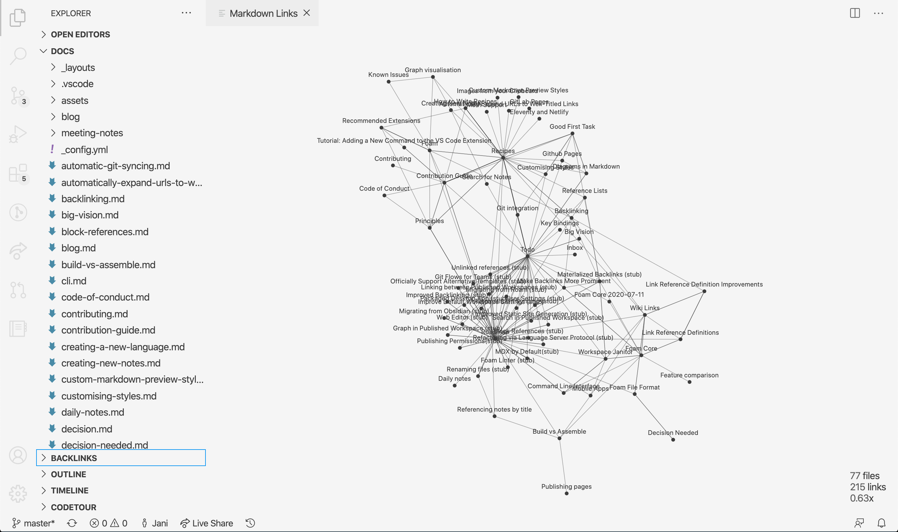

# Call for Visualization

Interested in building visualizations on top of [Foam](https://foambubble.github.io/foam/)?

## Background

**Foam** is an ecosystem of tools for creating, sharing and publishing your personal knowledge base, digital gardens, etc.

Right now, we use the excellent [tchayen/markdown-links](https://github.com/tchayen/markdown-links) VS Code Extension to render graphs, but it's clear that for larger workspaces, a simple network visualization is not optimal.

Here's an example of what **Foam**'s own documentation workspace looks like after 1 month of content creation:

In this graph
- Each point (node) is a markdown document in your Foam, and
- Each line (edge) is a link between the documents.

I'd like to explore alternative ways of visualizing a graph of documents. There are many possible use cases for such a visualization:

- Navigation inside VS Code (visualisation can send back events to navigate in/between documents etc)
- Website navigation in a published Foam
- Zooming in/out
- Discovering connections
- Organising/structuring
- Decoration/inspiration
- Etc.

In addition to just nodes and edges, we could consider other data points:
- Length of document
- Number of in/out edges
- Frequency of updates over time extracted from workspace git history...
- etc.

## Data

- Foam uses [dagrejs/graphlib] to represent the graph of documents.
-  See [data/foam-docs-2020-07-16.json](data/foam-docs-2020-07-16.json) for an example of such structure.
- You can use [graphlib.json.read](https://github.com/dagrejs/graphlib/wiki/API-Reference#json-read) to rehydrate the graph if needed.

## Tools

Any HTML/JavaScript can work! As long as it runs in a web browser such as the [VS Code WebView](https://code.visualstudio.com/api/extension-guides/webview), it can work with Foam!

This [list of graph visualization libraries compiled by Elise Devaux](https://medium.com/@Elise_Deux/the-list-of-graph-visualization-libraries-7a7b89aab6a6) is just a few!

## Interested?

If you're into dataviz and want to help people visualize their knowledge graphs, post ideas, prototypes and hacks as issues and PRs to this repository!

A simple HTML file is a good starting point! If we discover an interesting visualization and want to bring it into VS Code or the Foam website template, we can work together to integrate it.

Hop onto [Foam Discord](https://discord.gg/rtdZKgj) for more information!

## Long term vision

In the long term, Foam could have a generalised "framework", where anyone can drop a plain HTML document that knows how to read a Foam graph into their workspace, and turn it into a useful visualization.